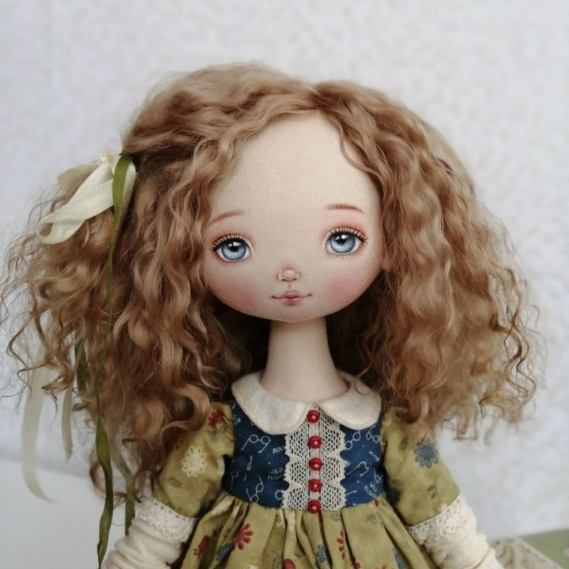
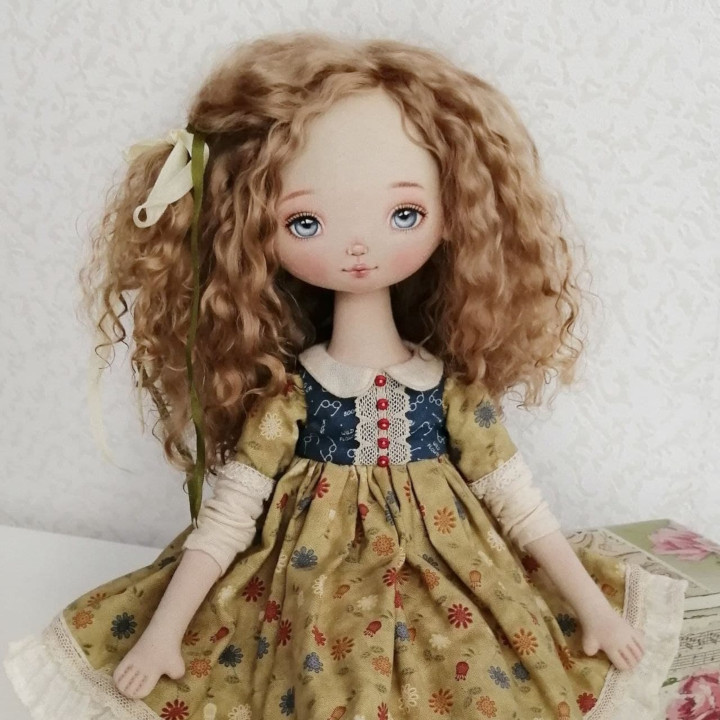
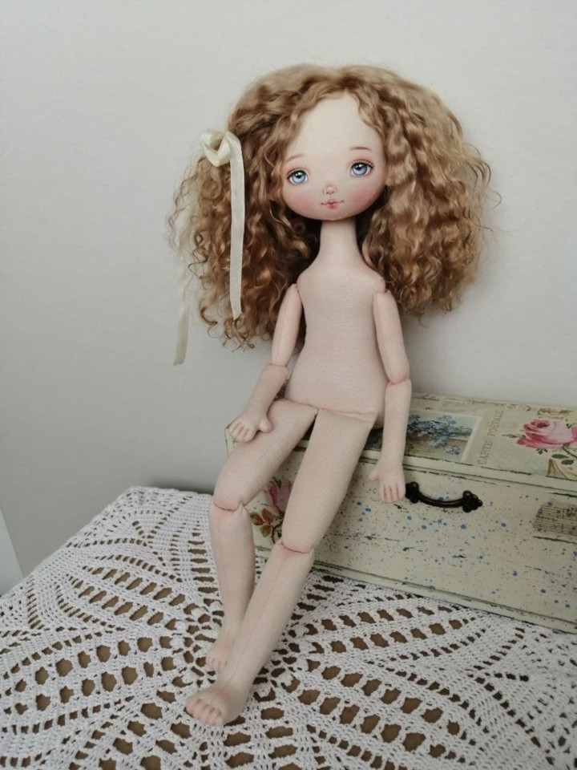
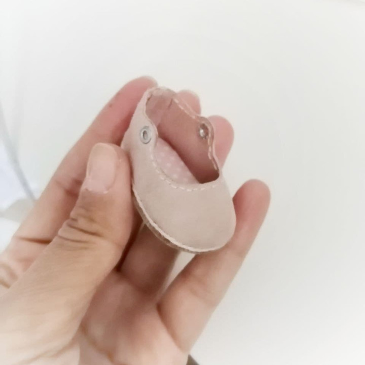

**Курс «Кукла Рамона»**

Текстильная кукла ростом 37 см, кукла сидит, в теле песочек для утяжеления, сама не стоит.
Колени и локти имеют крепление похожее на шарнирное, но не используются бусины.
Голова поворачивается.

      

Что входит в курс:

Тело куклы   
	раскрой  
	сшивание деталей  
	набивка  
	соединение набитых деталей)

Одежда 2 вида  
	платье с рукавами  
	платье без рукавов  
	пиджачок,   
	панталоны, носочки, чулки  
	2 пары обуви  
Роспись лица  
	основа лица на бумаге с размерами  
	разметка лица на голове куклы карандашом  
	тонировка тела и лица пастелью  
	роспись лица акриловыми красками  
	закрепление росписи  
Прическа из кудрей козочки  
	смешанный способ трессы и приклеивание пучками  
	укладка распушившейся прически  

Курс подробный и состоит из видео-уроков в закрытой группе в контакте, 
доступ постоянный, всегда можно обратиться ко мне за помощью если что-то неясно.

Все уроки показаны с с нуля, поэтому подходит даже для новичков!
В Телеграмм у нас есть чат общения участниц.

Работы моих учениц

Стоимость курса 2700 руб

Чтобы купить, напишите в удобный для вас мессенджер

  

Написать в Telegram

 
      
 

');" style="cursor:pointer;border-width:0;border-style:solid;background-color:#01e675;width:100%;text-align:center;color:#3a1d03;-moz-border-radius: 30px;vertical-align: middle;height: 32px;padding-top: 10px;margin-top: 8px;margin-bottom: 8px;
      -webkit-border-radius:50px;">Написать в WhatsApp

