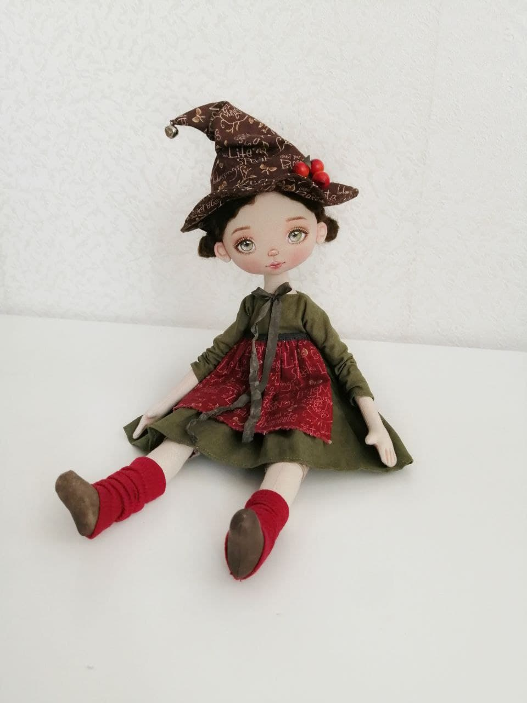
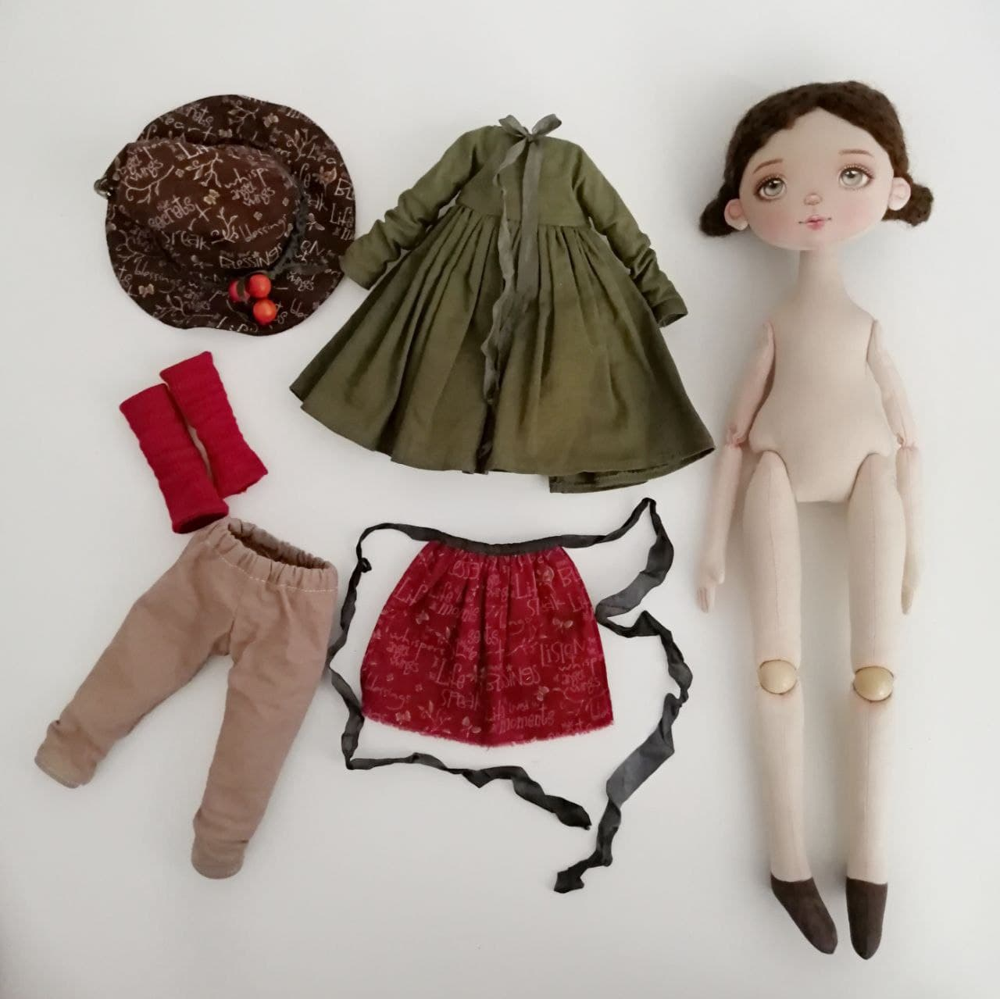
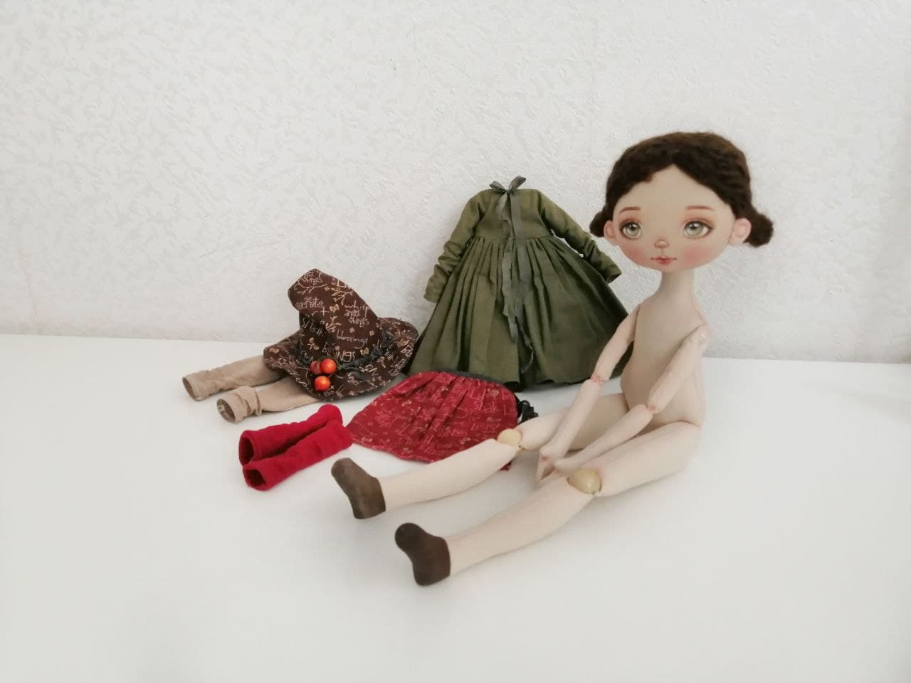
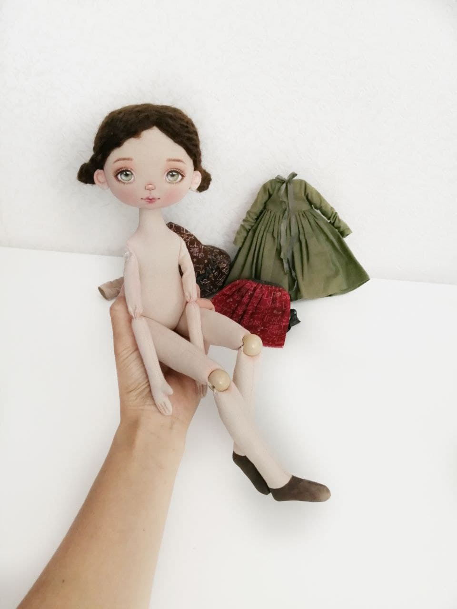
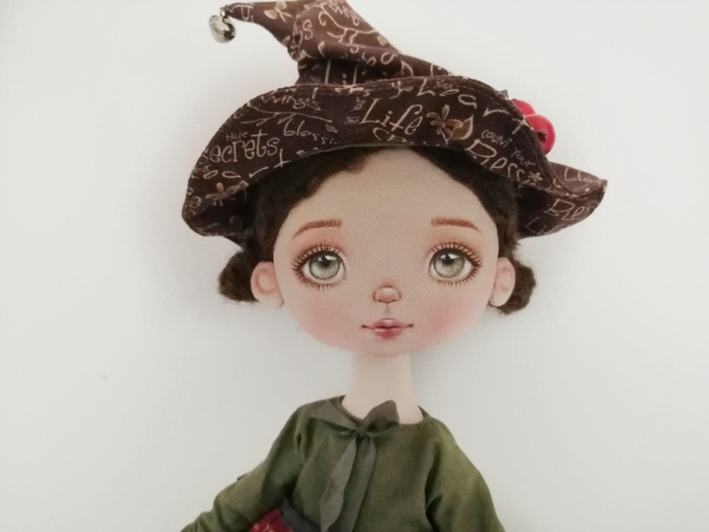

Курс "Ведьмочка Хельга" (или Новогодняя Гномочка)

Текстильная длинноногая кукла ростом 40 см, кукла сидит сама, не стоит.
Колени имеют шарнирное крепление с бусинами.
Голова поворачивается.   
Вместо ведьмочки можно сшить новогоднюю гномочку) Просто взять новогодние ткани.  
Описание под фотографиями. 
  

Ведьмочки сшитые ученицами

 

     

Что входит в курс:

Тело куклы   
	раскрой  
	сшивание деталей  
	набивка  
	соединение набитых деталей  
  вставляем бусины в колени (в локти можно таким же образом вставить бусины)
  
Одежда
  шляпа ведьмы с украшением (2 способа)   
  платье с рукавами  
	штанишки
  фартук с рисунком тыквы
  гетры из трикотажа
  обувь рисуем акрилом
  
Роспись лица   
	основа лица на бумаге с размерами  
	разметка лица на голове куклы карандашом  
	тонировка тела и лица пастелью  
	роспись лица акриловыми красками  
	закрепление росписи 
  
Прическа из шерстяных ниток   
  пришиваем волосы к голове   
 

ПОДАРОК к курсу:   
выкройка этой же куклы ростом 32 см (выкройка длинноножка,выкройка ботинок к ней без описания) 

Курс подробный и состоит из видео-уроков в закрытой группе в контакте, 
доступ постоянный, всегда можно обратиться ко мне за помощью если что-то неясно.   

Все уроки показаны с с нуля, поэтому подходит даже для новичков!   
В Телеграмм у нас есть чат общения участниц.   
 
Стоимость курса 1500 руб   

Чтобы купить, напишите в удобный для вас мессенджер

  

Написать в Telegram

 
      
 

');" style="cursor:pointer;border-width:0;border-style:solid;background-color:#01e675;width:100%;text-align:center;color:#3a1d03;-moz-border-radius: 30px;vertical-align: middle;height: 32px;padding-top: 10px;margin-top: 8px;margin-bottom: 8px;
      -webkit-border-radius:50px;">Написать в WhatsApp

