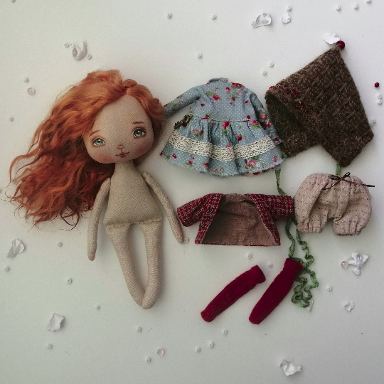
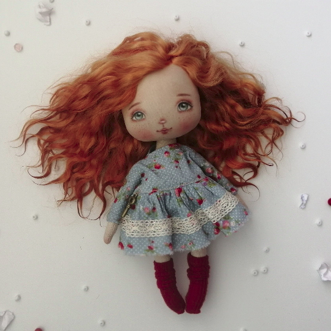

Видеозаписи Совместного пошива «Кукла Элли»

Весь июль CКИДКА 30%
   

Текстильная кукла ростом 19 см (и 26 см), кукла сидит, в теле песочек для утяжеления, сама не стоит.
Голова поворачивается. Небольшая милая куколка. Описание под фотографиями.   

      

Что входит в курс:   

Тело куклы   
	раскрой   
	сшивание деталей   
	набивка   
	соединение набитых деталей   

Одежда   
	платье    
	пиджачок   
	панталоны,гольфы      
	шапочка    

Роспись лица   
	грунтовка лица   
	основа лица на бумаге с размерами   
	разметка лица на голове куклы карандашом   
	тонировка тела и лица пастелью   
	роспись лица акриловыми красками   
	закрепление росписи   

Прическа из кудрей козочки   
	приклеивание пучками к голове   

Все уроки показаны с с нуля, поэтому подходит даже для новичков!   
Обычная цена 1000 руб

Чтобы купить со скидкой 30%, напишите в удобный для вас мессенджер

  

Написать в Telegram

 
      
 

');" style="cursor:pointer;border-width:0;border-style:solid;background-color:#01e675;width:100%;text-align:center;color:#3a1d03;-moz-border-radius: 30px;vertical-align: middle;height: 32px;padding-top: 10px;margin-top: 8px;margin-bottom: 8px;
      -webkit-border-radius:50px;">Написать в WhatsApp

